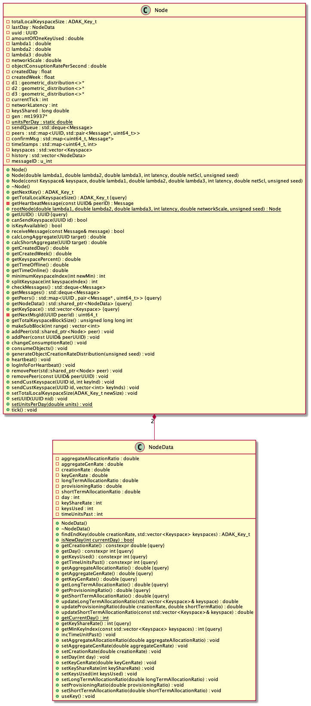

# ADAK - Algorithm for Distributed Architecture Keying Simulation

## Introduction

This implements a simulation of ADAK, a scheme for providing coherent primary key generation in a peer-to-peer replicated environment. The scheme has the following characteristics:

1. Compatibility. ADAK is compatible with traditional database schemas using an autoincrement primary key, without using a composite key of any kind.
1. Peer-to-Peer. ADAK works peer-to-peer, where no node is required to be configured as “primary” or “master”.
1. Graph-Connected. ADAK works with a redundant graph-connected replication setup, where there can be cycles in the connectivity graph of the nodes.
1. Indefinite Isolation. ADAK allows nodes to continue to operate indefinitely, including virtually unlimited data creation and keying, while node(s) are isolated from other nodes.
1. Avoids “Holes” in Key Sequence. The ADAK scheme tends to avoid “holes” in the incremental key sequence, or unused key values. Such holes can occur, especially during node isolation, but the system tends to fill them in.
1. Avoids Magic Keys. Key values look normal, and don't contain magic number sequences. You will not need to have keys of the form NNN-XXXXXX, where NNN is the node ID and XXXXXX is the record ID created by that node. Simple integer values can be used for keys.
1. Minimize Knowledge. The ADAK scheme minimizes the amount of data about distant nodes that is distributed throughout the network. The hope with this principle is to limit the amount of damage caused by a compromised node or communication channel.

These characteristics make ADAK especially well-suited for Hybrid Cloud Computing systems deployed in the Majority World, where power and internet are not nearly as reliable as they are in the Western World.

(This entire introduction was lifted from [ADAK Keying Scheme](ADAK%20Keying%20Scheme.pdf).)

## Build Instructions

```
mkdir build
cd build
cmake .. -DBUILD_TESTING=0
make -j4
```

Notes:

1. The `-DBUILD_TESTING=0` flag disables building unit tests. Building the unit tests adds a decent bit of time to a clean compile and is not currently working.

1. The `-j4` flag specifies number of cores to be used for the build. Use up to 1 or 2 fewer than you have. Use either `nproc` (Linux) or `sysctl -n hw.ncpu` (MacOS) to find number of cores.

The build will be completed at this point, executable is in `src` directory.

Build scripts:

1. Use the `Makefile` in the top level directory to build: `make`

1. Or use the `build.sh` script in the `scripts` directory if that is helpful: `sh scripts/build.sh`

## Configuration for simulation

The project is configurable via the Config class (`include/config.hpp`, `src/config.cpp`) via JSON. The simulation will look in the same directory as the executable for `config.json`.

## General Simulation Tunables

The simulation a has several tunables which can be used to affect how it will run. The most straightforward of these are as follows:

- *simLength*: This determines the length of the simulation in seconds, which is equivalent to the smallest possible timestep, or tick.

- *numNodes*: This determines the number of nodes the simulation will contain

- *Hearbeat_Frequency*: This controls how often nodes will perform a heartbeat, which comprises sending heartbeat information messages and determining whether or not to send keyspace.

- *Latency*: The latency, in seconds, is how many ticks between the sending and receiving of a message. The minimum value is 1, which simulates sending a message and having it received the next timestep.

- *randomSeed*: Set this to non-zero value for making runs repeatable that have same config file.

- *Chunkiness*: this is how many keys will be sent in sub-blocks. This could be calculated by the algorithm based on need, but in its current state the simulation just uses the value specified here.

- *Network Connection Modes*: There are 4 connection modes. To change the connection mode, alter connModeStr in the config file. The three options for the connection mode are: *full*, *partial*, *single*, and *custom*.

  - Full connection mode: creates a full connected graph out of the nodes.

  - Partial connection mode: randomly connected graph (dependent on Config.visiblePeer's percentage connected).

  - Single connection mode: randomly connected MST (one connection only per node determined on creation).

  - Custom connection mode: Connections in the graph are specified in "Custom_Connections" with the following form: `[1, 2] [2, 3], ... [m, n]`, where the numbers are any names that do not contain `[`, `]`, or `,` characters (note that this is a string, and must be in quotation marks in the config.json file). Each `[a, b]` pair specifies a connection between nodes a and b. The numNodes parameter is still taken into account. The program will notify the user if there are not enough nodes to make the specified connections, but will run with all of the connections that can be made. Having too many nodes simply leaves the excess nodes unconnected to the network.

- *Online/Offline Times*: In the simulation, nodes are randomly selected to disconnect and reconnect. The disconnect/reconnect times are randomly generated from a geometric distribution, and the disconnect/reconnect times are measured in time steps (each time step represents a second of "real time" passing; currently the time step is controlled by ticks, with each tick representing a second). Nodes that are selected to disconnect/reconnect are handed a message that describes when to disconnect and then subsequently reconnect.

  - *lambda 1 (time offline)*: Expected time for nodes to go from online to offline in (real world) seconds (&lambda;1). For each selected node, a time in seconds is randomly generated by sampling from a distribution that is geom(&lambda;1/TIMESTEP). This value represents in how many seconds from the current time the node will disconnect. For example, if a value of 10.5 is randomly generated from this distribution, then 10.5 seconds from the current time, the node will go offline.

  - *customLambda1*: this specifies an array of values to be used for the lambda1 values. If there are n values listed, they will be assigned to the first n nodes created in the simulation. Any excess values will simply be unused. If there are more nodes than values, the remaining nodes will simply be assigned the Lambda1 value.

  - *lambda 2 (time online)*: Expected time for nodes to go from offline back to online in (real world) seconds (&lambda;2). For each selected node, a time in seconds is randomly generated by sampling from a distribution that is geom(&lambda;2/TIMESTEP). This value represents the total amount of time the node will remain disconnected. For example, if a value of 10.5 is randomly generated from this distribution, then 10.5 seconds from the disconnect time, the node will come back online.

  - *customLambda2*: same as customLambda1 above, but for the Lambda2 values.

  - *runEvents*: This is a boolean variable which determines if nodes will sleep or wake up. True results in the sleeping and waking, while false just leaves all of the nodes awake permanently.

- *Object Consumption Rates*: Each node will consume keyspace based on a geometric distribution with lambda lambda3 (as long as they have keyspace).

  - *customLambda3*: There is also the option within config.json to edit consumption rates per node, which specifies how fast each node would consume keys it is given; this is specified in the following form `[1,2,3,4]` where each number is a member of a vector and represents the rate of consumption per each sequential node (the first node would have a consumption of 1 in this example).

  - *lambda_3_(time_between_creating_objects)*: In the absence of a customLambda3 parameter, an empty customLambda3 list, or any nodes beyond the number specified in the customLambda3 list, the simulation will default to the *lambda_3_(time_between_creating_objects)* value.

- *Other*:

  - *Long_Term_Precision*: this parameter specifies how accurately the simulation will reflect keyspace sharing within the algorithm. In short, the minimum keyspace block size (full block, not sub-block) the simulation will attempt to share will be a block with suffix n, where n = precision. This block would make up (&frac12;)^n of the total keyspace.In the current state any value above 32 will result in errors, since a suffix of 32 results in a keyspace of just 1 key since the maximum value is UINT_MAX (so a suffix of 33 can result in keyspaces with no keys, which will throw an error when someone attempts to consume a key).

  - *networkScale*: This value, as defined in the ADAK specification, is default 0.3, and is used to prevent aggregate data from propagating too far around networks. It is multiplied by the sum of the peer aggregates before adding in the node's own raw creation rate to produce its own aggregate.

  - *Graph Scale*: this determines whether the graphs will display with a logarithmic or linear y axis. This has no effect on the simulation, and is only compatible with datavs2 currently. Modifications to include datavis should not be difficult, however.

- *Unused*: There are several other miscellaneous values which were added by code-a-thon teams but do not currently affect the program.Some of them are already taken into the program, but are never used Here is their proposed functionality:

  - *Max_Keys_(2^n,_give_n)*: This value could be used to replace the UINT_MAX as the maximum value for keys. A different data type may need to be used for the keyspace data members and other relevant sections of the code to accommodate larger key values. The config struct already contains it, it is just never checked in the code.

  - *Algorithm_Strategy*: Once multiple control strategies are defined, this could be used to specify which one. Currently there is only one (temp based). This is in the config struct, but is never used.

  - *Smallest_Key_for_Priority*: this is also intended to influence how the algorithm makes decisions, but again, only one control is available, so this is unused. This is in the config struct, however.

  - *creationRate*: this is a redundant value; It would serve the same purpose as lambda 3, and thus needs to be removed. It is in the config struct, though it likely needs removed.

  - *csvOutputPath*: the path for where to place the output csv. This is a copy of the csv, and is used to keep a record of past tests on the server.

  - *Creation_Rate(%_of_keyspace)*: Although somewhat redundant, this value could replace the standard consumption rate for some algorithms/tests, since lambda3 is independent of the amount of keyspace a given node has.

  - *Topology*: a redundant value added by the GUI. It would serve the same purpose as the connectionMode, and thus is not needed. It is NOT in the config struct, and is thus totally unimplimented.

### Adding new Items to Config

Adding more items is relatively simple:

1. Add a constant default value for the new item in the `config.hpp` file

1. Add a data member for the new item in the `config.hpp` file

1. In the `config.cpp` file, locate the `if/else` structure that repeats. Add in a similar structure for the new item such that if the value is in the config it is set to that new value, and if not it is set to the default specified in step 1.

1. Add the value to the json with the name you specified in step 3.

The value will now be a data member of any config type variables created. The config is a astruct, so the data members can all be accessed with the "." operator. The simulation class features a config variable which can be used to pass values off to the network, node, or simulation classes and/or variables.

Example `config.json`

```
{
  "Visible_Peers_(connected_%)": 1.0,
  "Algorithm_Strategy": "temperature based",
  "Smallest_Key_for_Priority": "smallest overall",
  "Lambda_2_(time_online)": 2.0,
  "Long_Term_Precision": 1.0,
  "networkScale": 0.3,
  "connectionMode": "full",
  "Chunkiness_(#_of_keys_to_shift)": 2.0,
  "creationRate": 10.0,
  "lambda_3_(time_between_creating_objects)": 2.0,
  "csvOutputPath": "Path of Righteousness",
  "Creation_Rate(%_of_keyspace)": 2.0,
  "Heartbeat_Frequency": 2.0,
  "Lambda_1_(time_offline)": 20.0,
  "numNodes": 3.0,
  "Max_Keys_(2^n,_give_n)": 12.0,
  "simLength": 60.0,
  "Custom_Connections": "[1, 2] [2, 3] [3, 4] [4, 1]",
  "Topology": 1.0,
  "Latency": 1,
  "runEvents": false,
  "customLambda3": [60, 60, 60],
  "customLambda2": [1, 2, 3],
  "customLambda1": [10, 20, 30]
}
```

## Configuration for visual analytics

The visualizations created by the project require Python as well as the *pandas* and *plotly* modules to be installed. This assumes that *pip* has been installed to manage Python packages.

```
pip install pandas
pip install plotly
```

Alternatively, if *pip* does not work well on your machine, here are alternate instructions.

```
sudo-apt install python3-pandas
```

For more information on [plotly](https://plot.ly/python/getting-started/). For more information on [pandas](https://pandas.pydata.org/pandas-docs/stable/getting_started/install.html).

The analytics also require the *numpy*, *matplotlib*, *os*, and *seaborn* libraries. They can be installed similar to the *pandas* library above.

## Configuration for User Interface

(also requires the configuration for visual analytics for the visual analytics to work properly through the UI) The User Interface created requires Python as well as the tkinter interface and sshpass. To install tkinter and sshpass on linux use:

```
apt-get install python3-tk
sudo apt-get install sshpass
```

The GUI also requires the *seaborn*, *multiprocessing*, and *time* python libraries. They can be installed in a similar fashion as the libraries mentioned under [Configuration for Data Analytics](#configuration-for-data-analytics), above.

#### Linux

Ubuntu was used for development and testing of the GUI.
#### Windows

The GUI needs to be launched either in an Ubuntu like OS, or using an Ubuntu like OS via the Windows subsystem. [This article](https://docs.microsoft.com/en-us/windows/wsl/install-win10) should be helpful in getting the Windows subsystem set up. The section on updating to WS2 is not needed.

The system will also need Xming to be downloaded. It can be downloaded from [their website](http://www.straightrunning.com/XmingNotes/) or from [sourceforge](https://sourceforge.net/projects/xming/).

#### MacOS

The simulation, analysis, and GUI run in MacOS using one of several methods:

1. Use pre-installed python and *pip* to add libraries.

1. Use [homebrew](https://brew.sh) to install latest version of python and then use *pip* to add libraries.

1. (Recommended) Use [homebrew](https://brew.sh) to install [Miniconda](https://docs.conda.io/en/latest/miniconda.html) in a virtual environment:

  ```
  brew install --cask miniforge
  conda create -n venv python=3
  conda init bash
  conda activate
  conda install pandas
  ```

  Add other libraries in the same manner. [HT autitya](https://stackoverflow.com/questions/65084318/trouble-installing-pandas-on-new-macbook-air-m1)

The two latter methods have the advantage that they do not require *sudo*.

## User Interface Start

#### Windows client, LightSys VM server

If you're on Windows, start xming. It will run in the background, so no window should appear. Type the following command in the Ubuntu subsystem:

```
export DISPLAY=:0
```

This outsources the display of the GUI to the xming running on windows (assuming you are using the windows subsystem).

Next, navigate to the `client` directory in `DistKeySim`. It should be found under the following path:

```
$HOME/WHEREVER_YOU_SAVED_IT
```

Example:

```
/Users/twestley/Dev/LightSys/DistKeySim
```

Then run GUI.py with python3 using the parameters:

1. Server IP address, as specified by LightSys

1. Username for the server

1. Password for the server

1. FULL DistKeySim folder location on the server (including the DistKeySim folder)

1. The port to connect to the server

The end command should look like this:

```
python3 GUI.py IP_ADDRESS USERNAME PASSWORD FILE_PATH PORT
```

#### Local Linux or MacOS client, LightSys VM server

If you're developing on a Linux computer, there's no need to run xming. Set your display environment variable as shown above and start GUI.py as shown above.

#### Local client, local server

The GUI has not yet been configured to let you run on your local Linux or MacOs computer.

## User Interface Parameters

Different parameters in the simulation are controlled by inputs from the UI. Below is a description of each of those inputs as well as how they will be used. Several of these inputs are used as parameters into statistical distributions from which we sample. We describe the distributions and their parameters.

- *Visible Peers (connected %)*: This input field only influences the simulation when the connection mode is set to *partial* in the config file. When a new node is added, this is the % chance that the new node is connected to another node. For example, if you desired there to be a 75% chance that a new node is connected to another node, then you would enter 75.

- *numNodes*: Sets the *numNodes* parameter described [above](#general-simulation-tunables).

- *Lambda 1 (time offline)*: Sets the *Lambda_1_(time_offline)* parameter described [above](#general-simulation-tunables).

- *Lambda 2 (time online)*: Sets the *Lambda_2_(time_online)* parameter described [above](#general-simulation-tunables).

- *Network Scale*: Sets the *networkScale* parameter described [above](#general-simulation-tunables).

- *Max Keys (2^n, give n)*: Currently a dummy value, but could be used to set a cap lower than the value of UINT_MAX currently used.

- *Lambda 3 (time between creating objects)*: Expected time for nodes between creating objects; how expected much time passes for nodes between creating one object and creating the next object (&lambda;3). Upon creation of each node, a time in seconds is randomly generated by sampling from a distribution that is geom(&lambda;3/TIMESTEP). This time represents the amount of time this node takes between creating objects.

- *Chunkiness (# of keys to shift)*: The number of keys that are sent when another node requests more keyspace. For example, if a value of 10 is entered, then every time a node requests more keys, 10 keys are sent to that node.

- *Heartbeat Frequency*: Time in seconds between two consecutive heartbeats. A heartbeat is a message that is broadcast to all connected nodes to indicate that a particular node is online and connected. A heartbeat is different from a time step in that a time step is a unit of time passage in the simulation. In this simulation a loop keeps track of the current tick, with each iteration representing a second of real time passing.

- *Long Term Precision*: Sets the *Long_Term_Precision* parameter described [above](#general-simulation-tunables).

## Repeatability

Repeatability of simulations is useful mostly for debugging. ADAK allows you to run either repeatable or non-repeatable. To run repeatable, set the random seed to a fixed positive (non-zero) number. Your `config.json` file should contain a line such as the following:

```
"randomSeed": 25,
```

You can compare any two runs of a set of runs using the same seed. To compare the files, you must sanitize them first.

The Makefile enables you to test for repeatability and non-repeatability.

### Test for repeatability

To test for repeatability for two nodes, run the following once:

```
make run-repeatable sanitize
```

Then run the following as many times as you feel necessary to test repeatability:

```
make run-repeatable sanitize compare
```

`make sanitize` replaces UUIDs in `logOutput.txt` and `statslog.csv` with node index thus making the files comparable.

### Test non-repeatability

To test non-repeatability with two nodes, run the following at least once:

```
make run-non-repeatable sanitize
```

Then run the following which should fail on the compare:

```
make run-non-repeatable sanitize compare
```

You can use diff, sdiff, or vimdiff to see the differences. When viewing the differences, be sure to sanitize and diff the *.clean.txt files so that you're not seeing just the UUID differences.

Note that if you compare a repeatable run (fixed random seed) with a non-repeatable run, they will not compare equal. They will only coincidentally and rarely have the same seed.

## Visualizations

There were several different visualizations with which we experimented. These are run by two different python scripts (DataVis.py, DataVis2.py) in the project. Below, by file, are listed descriptions of the different visualizations. Both run on the provided data and can take up to several minutes to display.

### DataVis.py

Running this script will result in three pages opening in the default browser. The three analytic graphs that are displayed are described below. Note: for large datasets, this script takes an`extremely long`amount of time to run, and while it offers some insight, the density of nodes can render it largely indecipherable.

It's important to know what you're looking at when analyzing the analytics that are produced. For each graph, hovering over a point displays a box with exact data about that node.

#### Node consumption and keyspace size over time

This graph displays how the consumption and keyspace size vary for each time step over the course of the simulation. Each node is a different color. The size of each point varies with the size of the keyspace; the larger the point, the larger the keyspace of that node at that time step. The y-value of the point (how high it is relative to the y-axis) corresponds to the consumption of the node at that time step. The greater the y-value, the more objects created; the smaller the y-value, the fewer the objects created.

- Information displayed by hovering cursor:
  - In the box: The time step, consumption, total keys in the keyspace
  - Next to the box (in colored text): ID of the node

| Good performance indicators         | Poor performance indicators          |
| ----------------------------------- | ------------------------------------ |
| A large point high up on the y-axis | A large point low down on the y-axis |
| This indicates that the node is creating a lot of objects, but it also has lots of keys | This indicates that the node is creating a lot of objects, but it does not have keys and might be at risk of running out |
| A small point low down on the y-axis| A small point high up on the y-axis  |
| This indicates that the node is not creating many objects, and it does not have many keys, so it is not at risk of running out | This means that the node is creating many objects, but it does not have many keys, so it is at risk of running out |

When looking at the graph, there is a healthy pattern for node behavior that should be occurring. A node with high consumption should retain its size, or should get gradually smaller and then return to its previous size or larger. This indicates that as it continues to allocate keys to the objects that it is creating, it is given more keys. A node with low consumption should retain its size without running out if it is small; if it is large relative to its consumption, then it should get smaller as it gives keys to other nodes that have higher consumption rate. At no point should any of the points completely disappear (run out of keys).

#### Node consumption and sharing over time

This graph displays how the consumption and sharing vary for each time step over the course of the simulation. Each node is a different color. The size of each point varies with the amount of keys that were shared by that node at that time step; the larger the point, the more keys the node gave to other nodes. The y-value of the point (how high it is relative to the y-axis) corresponds to the`consumption`of the node at that time step. The greater the y-value, the more objects created; the smaller the y-value, the fewer the objects created.

- Information displayed by hovering cursor:
  - In the box: The time step, consumption, total number of keys shared/given to other nodes
  - Next to the box (in colored text): ID of the node

| Good performance indicators             | Poor performance indicators             |
| --------------------------------------- | --------------------------------------- |
| A small(er) point high up on the y-axis | A large(r) point low down on the y-axis |
| This indicates that the node is creating a lot of objects, and it is not sharing (as) many keys, which is what we expect from an active node. | This indicates that the node is creating a lot of objects, but is still sharing many keys; thus, such a node might be at risk of running out. |
| A large(r) point low on the y-axis      | A large(r) point high on the y-axis     |
| This indicates that the node is not creating many objects, and it is sharing more keys with other nodes that ask for more. | This means that the node is creating many objects, and is sharing more keys with other nodes that ask more; thus, such a node might be at risk of running out of keys. |

When looking at the graph, there is healthy pattern for node behavior that should be occurring. A node with high consumption should retain its size, or get smaller if it had a relatively large size. This indicates that such a more active node does not superfluously/excessively give away more keys even though its own demand/need is large. A node with low consumption should retain its size or grow larger; if it is large relative to its consumption, then it should stay the same size or get larger as it gives keys to other nodes that have higher consumption rate. At no point should any of the points completely disappear (run out of keys).

#### Local keyspace remaining over time

This graph displays how the total local keyspace varies for node for each time step over the course of the simulation. Each node is a different color. The main thing to look out for is nodes that reach or near 0. The frequency with which nodes reach this point is a good indicator of how well the algorithm shares keys between nodes. If a large number of nodes frequently grounds, then it might indicate that nodes should share a greater number of keys with each other each time more keys are requested.

### DataVis2.py

This script produces two graphs for each node, a histogram and a KDE density plot.

1. Histogram: The x-axis is the number of keys/object; the y-axis represents the frequency that the node had that many object/keys. The axis used is NOT a standardize axis. That is, each histogram has different axis scales/values to make viewing the png as easy as possible. There are three kinds of information that are displayed on the histogram:

   <!--- This bulleted list requires three spaces so as not to break the ordered list into two lists.  --->
   - Trace 0 (Blue) is the total number of keys this node has.
   - Trace 1 (Red) is the total consumption for this node; that is, it is the total number of objects that this node created.
   - Trace 2 (Green) is the total number of keys that this node shared to other nodes.

1. Density plot: In many ways, the density plot appears like a smoothed over histogram. However, the KDE density plot is an statistical approximation of the distribution of the plotted entities. The x-axis is the number of objects, and the y-axis is the density. Because it is a statistical approximation of the distribution of data entered, it does allow for the distribution to have negative values; in this context, that doesn't mean anything (because we can't have negative keys), so all negative portions of the plotted distribution are ignored, and the x-axis only displays the portion of the distribution that is greater than or equal to zero. There are three kinds of information displayed on the density plot:

   - The blue density plot is the total number of keys.
   - The red density plot is the total consumption for this node.
   - The green density plot is the total number of keys shared by this node.

### A note about the visualizations

All visualizations are based off of the data output by the logging system to the `statsLog.csv` file. Given that certain parts of the algorithm have not been fully implemented/tested, care should be given when analyzing these data analytics. Use lots and lots of salt when viewing.... Also: NOTE: FOR THE HISTOGRAM, EACH NODE APPEARS IN ITS OWN BROWSER WINDOW. THAT MEANS THAT IF THERE ARE 100 NODES IN THE SIMULATION, 100 BROWSER WINDOWS WILL OPEN. BEWARE!! For the density plots, a window will open, and plots must be viewed one by one. Once you're done viewing the current plot, exit out of a window, and the next plot will appear. There is no way to go back to a previous plot. Given these inconveniences and limitations, we wanted to output these plots as PNGs and display them side-by-side for each node on an HTML page. As a consequence of our desire, we spent the next 4.5 hours trying to download/install/use the necessary dependencies to use the image_write() and savefig() functions. We did our best to install orca using multiple methods (including npm and conda), but alas, we were not able. This would be a good project for someone to work on in the future.

## Branches

We (the code-a-thon teams) kept master as our stable branch. We worked solely on development and then merged things that are fully functional to master. It is not 100% functionality, release candidate level, but they are stable and will compile/run without trouble.

After code-a-thon, all progress was developed on the server, so no branches were made.

## Algorithms

Although the simulation could easily be made to have the option to switch between multiple algorithms, the current implementation only features one.

In further development of this project, it may be worthwhile to examine some alternative strategies that can be implemented by extending the `ADAKStrategy` class in a new class. Due to time considerations, we did not implement any alternatives to the algorithm given in the specification (aside from the Control strategy). However, we did propose an optimal alternative algorithm. The general idea is described as follows.

In this algorithm the node will look at all of it's peers. It will calculate the average keyspace size that each node should have if we are to reach "equilibrium" (where equilibrium is defined as all the nodes having very close provisioning rates -- which is object creation rate multiplied by long term allocation rate Al -- which is object creation rate over keyspace in a node, otherwise defined as how fast a node is consuming the keyspace it has been given). If the keyspace of the current node is smaller than or equal to that average, the node does nothing. However, if the node's keyspace is larger, it will share its keyspace surplus with it's peers.

The keyspace sharing mentioned above will take place in the following way. First, look through all of the Nodes' peers. For each peer with a keyspace size less than the average, add up the deficit. Second, create an int array of all the peers who were under the average. Third, for each peer under the average, set the respective spot in the array with the quantity (Node surplus * peer deficit/sum of deficit). For each index in that array use a binary expansion to determine how big of blocks to send.

Each node will use this algorithm and it's repeated running will result in the whole network ending in a balanced state. This algorithm will avoid oscillations as well because a node will give away more keyspace than its surplus.

This algorithm is now in the code, although the current implementation fails to dampen oscillations. This will need to be improved.

## Scenarios

Test scenarios are described in [ADAK Scenarios 1](ADAK%20Scenarios%201.pdf). This section described results of running these scenarios.

### Scenario 1
The objective of Scenario 1 is to "ensure the functionality of sharing keyspace blocks and the stability of subblock sharing." The evidence of this is that "there should be minimal, if any, subblock sharing." The following config file was used for testing:

```
{
    "Algorithm_Strategy": "temperature based",
    "connectionMode": "full",
    "csvOutputPath": "outputs/",
    "Latency": 40,
    "lambda_3_(time_between_creating_objects)": 1000,
    "networkScale": 0.3,
    "numNodes": 2,
    "randomSeed": 25,
    "simLength": 86400000,
    "Units_Per_Second": 1000
}
```

## Code

### Overview

The algorithm is spread across several documents, and is divided up into two key segments: the algorithm, which is written in C++, and the GUI, which is primarily in python but also has a bash script.

The C++ simulation uses a config file as an input, and creates the statslog.csv and logOutput.txt files. The statslog.csv stores the data produced by the simulation, namely the UUID of the node who"s data is being displayed (UUID), the timestep it was taken on (timeSlot), the total percentage of the keyspace the node is holding in terms of full blocks (totalKeys), the amount of keyspace shared in terms of the total keyspace (sharing), the rate at which a node is consuming keyspace at a given tick (consumption) and the total number of keys the node still has (remainder). The logOutput file just contains statements that would typically be printed to cout that were worth logging.

The Python GUI code takes the input from the user, updates the config.json file, and uses ssh to move the config.json file to the server, build the project, run it, and then copies the statslog and logOutput files back to the client computer. The GUI then runs data analytics on the .csv file and produces the graphs.

NOTE: There are numerous print statements which do not match the indentation of the text. These are used for debugging on the server. They were left in because of how frequently those sections of the code need debugging.

### C++ Classes and Files

The C++ code consists of several classes spanning the include and src folders, composed of the .h/.hpp files and the .c/.cpp files, respectively.

#### ADAKStrategy (.h only)

This file is a virtual class which control strategies are meant to inherit from. Its outline is largely unused in the current set up; the ticking set up currently used is not the same as the nodeTick system outlined here. The ControlStategy class does inherit from this class, however.


#### Channel (.h and .cpp)

This class defines a channel, or a link between two nodes. It stores a toNode and a fromNode, but it is used as a bidirectional channel. It is largely just used to keep track of connections and the class is just a few private data members, getters, and a constructor.


#### Config(.hpp and .cpp)

The config class is used to retrieve the values from the config.json. The constructor takes the filename as a parameter and then stores the values into its own local data members. If an item is missing from the config the program will simply store the default value, as specified in config.h, for the missing value.


#### ControlStrategy (.h and .cpp)

This class is an implementation of the ADAK strategy class. It primarily supplies the control for keyspace sharing in the algorithm. The ControlStrategy and NodeTick functions are unused. The adak function provides decision making. It accepts a node the the number of keys to shift , or chunkiness, as parameters. Based on the node"s own data and data received from its peers in heartbeat messages the node may split a keyspace block with a node that has no keyspace, share a keyspace block to help eliminate an imbalance in the provisioning ratio between nodes, or share a subspace block to help eliminate holes in the keyspace (this last section is split into its own function). The fractToBin function was used to help determine what keyspaces to use, but has science been optimised out of the program.

#### EventGen (.h only)

This is a virtual class meant to provide a basis for a class that decides when nodes should sleep or wake up. Geometric disconnect implements this class.


#### GeometricDisconnect (.h and .cpp)

This class controls when nodes should sleep or wake up based on lambda1 and lambda2 as specified in the config class.


#### Json (.hpp only)

This is an include file meant to help with reading from json. It was not developed by any of the LightSys teams, and is used under the MIT License. Do NOT edit the file unless you are absolutely certain what you are doing.

#### Keyspace (.h and .cpp)

The keyspace class defines the blocks of keyspace, both full blocks and sub-blocks, as specified by the ADAK algorithm. Full blocks simply have an end set to UINT_MAX, while sub-blocks have an end less than that value. Variables store the start, end, and suffix of the keyspace, as well as the long term allocation value of that specific keyspace. Functions include the following:

- Getters for all of the values

- isKeyAvailable, which returns a boolean representing the validity of the keyspace

- getNextAvailableKey, which returns the value of the start key and increments the start to the next key in the keyspace.


ADAK_key_t is defined as ```typedef std::uint64_t ADAK_Key_t```.

#### Logger (.h only)

The logger class provides the functions which log to the statslog.csv and logOutput.txtx files. It keeps its own internal timings and statistics for the .csv, so be careful when changing where/how the functions are used. It also stores copies of the generated statslog.csv and logOutput.txt, as well as the config.json file, in the outputs folder. This prevents the data from being lost when the simulation is run again.


#### Message (.hpp and .cpp)

These files abstract the message protobuf class. They define information record and keyspace record structs, as well as the following functions:

- newBaseMessage: this returns a message containing the data passed into it. It functions as an abstracted constructor.

- addCollectionInfoRecord: This creates an information record for use in an information message

- toInformationMessage: this converts a base message into an information message to be used for heartbeats,

- toKeyspaceMessage: This converts a base message into a keyspace exchange message, to be used for keyspace exchanges. The function is overloaded to allow just one keyspace record to be sent, or a vector of them.

#### Message (.pb.h and pb.cc)

These files are generated from the `message.proto` file. They should NOT be edited, as they are computer generated code. Ideally, changes would be made to the `message.proto`, which would then be used to generate these files with the desired changes.

#### message.proto

This function provides the instructions needed to generate the .hp.h and .pb.cc files discussed above.

#### Network (.h and .cpp)

This class handles all of the nodes in a network and handles their connections, heartbeats, and message sending. It can create nodes and connect them to the network as specified by the connection type, can simulate latency in message sending as specified in the config, and uses the custom consumption rates found in the config. This class is generally where any Node functionality would be called directly.


#### NodeData (.h and .cpp)

This class defines a data member all nodes will hold. It is primarily used to track statistics about what the node does, though it also features functions to calculate several of them. This is used in the rotating history of node tracks, with NodeData items being stored for up to a week..



#### Node (.h and .cpp)

This class defines the node data structure It defines functionality for how nodes should send, received, and confirm messages. It also handles how they consume keyspace and features several functions for splitting and sending their keyspace. The control and decision making for when to perform these actions is handled largely by the ControlStrategy and Network classes.

#### picoSHA2 (.h only)

This is an include file used under the MIT License. It is used in the UUID.h class


#### Random (.h and .cpp)

This class implements the eventGen class and defines the eventTick function. It is unused in the current code base as the system for sleeping is not consistent with the lambda1 and 2 as found in the config file. It could be useful for testing, however.

#### Simulation (.h and .cpp)

As mentioned above, this class essentially serves as the "main," and as such handles network initialization and handles the flow of the simulation from tick to tick.


#### SystemClock (.h and .cpp)

The system clock is used primarily by the GeometricDisconnect class to keep track of when nodes should sleep and wake. Other parts of the code may reference it as well, but most sections just simply use an int to keep track of the timestep.

#### UUID (.h and .cpp)

Handles the creation of UUID"s.

#### Main (.cpp only)

This is the main class for the program. It largely just sets up and calls the Simulation class.


#### CmakeList.txt

This file is associated with protobuf generation.

### Scripts (folder)

#### build.sh

It erases and remakes the `build` directory each time it runs.

### Client (folder)

These files are stored in the client folder, and should run locally on the users computer rather than on the server. It contains the following:

#### GUI.py

This file specifies the functionality of the GUI window itself, as well as the writes to the config file.

#### Run.sh

This file specifies the ssh connections to the server, including coping over the config, commands to build and run the project, and coping the output files back to the client computer.

#### DataVis.py

Creates the line graphs described above under DataVis.

#### DataVis2.py

Creates the histograms described above under DataVis2.

#### Config.json

The configuration file that is copied to the server. See the section Configuration for simulation above for more details on its contents and use.

### Simulations (folder)

This stores all of the results from various simulations, organized by when they ran. Each time the GUI is closed and re-run it resents its count and starts overriding the folders again, starting from 0 and counting up.

## Future Improvements

### Overview

There are a few areas of the program which need more work

### Algorithm Optimization

The current algorithm, as mentioned before, is prone to oscillations. The comparisons need to be changed such that these oscillations no longer occur. This is particularly evident in ADAK Scenario 1 (see the ADAK Scenarios file).

### Expanding for larger Networks

### Keyspace Limitations

The current maximum keyspace size is only suitable for networks of size 18. This is because any keyspace with a suffix larger than 32 is invalid ( a suffix of 32 means each keyspace block only contains 1 key). Under the current algorithm, a node will give half of its largest keyspace block to a peer with no keyspace. At the start, the root node has the 0/0 block, realizes no one, has keyspace, and gives away n-1 (number of nodes - itself) blocks, resulting in a keyspace with suffix (n -1) being created. With the default latency of 1, when each node receives their keyspace, they believe that all of their peers except the rootnode still need keyspace. Thus they split for each of their peers, giving away n - 2 blocks. The node who received the (n -1) suffix block would have created a (n -1 + n -2) = (2n - 3) suffix block. If n is greater than 18, then an invalid 33 suffix block will be made, throwing an error. If the problem of nodes double sharing is fixed, then up to 33 nodes (n -1 = 32) could be supported. Supporting further nodes would require a larger keyspace.

### Speed Limitations

With the current algorithm, the runtime of the program will grow linearly with the length of a simulation. WIth 2 or 3 nodes, a simulation of up to a week can be run in a reasonable time frame (around 15 min).

The growth of the number of increases runtime linearly in some areas, such as running through heartbeats and simulations checks at the network level, but the actual runtime may vary. For a fully connected network the amount of work per node grows quadratically, since each node must send and receive messages for each of its peers. A ring topology would leave per-node operations constant, since each node would have two peers regardless of the number of nodes (for n &gt; 2). For a fully connected network, moving from 2 nodes for a day to 10 nodes for a day grows from less that 5 min to over 30 min. Given that fully connected networks should be rare, this may not be a significant problem.

### Logging Limitations

The logger currently logs one line of data per node per tick, resulting in (numNodes)*(simulationLength) lines of data. For longer simulations in particular this can create rather large files. It is recommended to open them with notepad++ as microsoft excel will only open the first part of the file, and notepad tends to freeze up when trying to open files. A simulation of 2 nodes for a day results in a csv file of over 13,000 KB, and 3 nodes for a week results in over 135,000 KB. Adding a logging frequency could improve the size of this greatly.

### Features to Add

There are several useful features which could be added to improve the simulation

- Multithreading: Adding a thread to handle node messages could speed up the algorithm (this is a somewhat outdated speculation, so make sure this would be beneficial before progressing)

- Automated testing: this could be implemented with catch2 libraries to test that the program passes tests after edits.

- Individual Message Failure: Adding a percent change of any given message failing to send could simulate minor network errors weather than only being able to simulate complete network connections.

- Use the `logOutput.txt`: Currently the only thing that is logged is the start of the simulation. At least an end time should probably be logged, and a few messages that print to `stdout` could be moved there. When the simulation is run with `run.sh`, `stdout` is written to `output.txt`.
